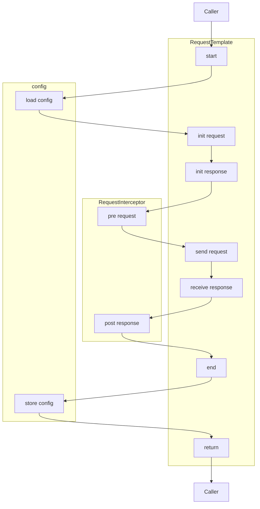

# PostTool
轻量级的、基于Java的、源码级的接口Post工具
> 由于本项目无界面, 需要借助IDE的界面来执行@Test代码以及查看对应的日志文件. 实际上可以在你工作时的IDE界面开启多一个窗口来运行本项目即可

# 1.快速开始
## 1.1.创建不同环境的配置文件
全局默认配置文件`src/main/resources/global.properties`
```properties
current.env=dev
token=default
```
dev环境配置文件`src/main/resources/env-dev.properties`
```
host=http\://localhost\:8000
token=abc
```
## 1.2.发起请求
可以参考`src/main/java/com/jax/PostTool/custom/Demo.java`中的示例方法
```Java
public void get() {
    RequestTemplate.get("/service/get",
        Headers.newHeader()
            .header("X-Auth", "A-#{token}"),
        Params.newParams()
            .param("name", "jax")
        ).request();
}
```
tips:
- 具体的请求日志在`src/main/resources/request/request.log`, 如果使用时间过长, 该日志文件会变得巨大, 请定期清理该文件
- 最近一次的json响应体存储在`src/main/resources/response/response.json`
- 上传文件时需提前移动到`src/main/resources/request/upload/`目录下
- 下载文件时, 文件将存储在`src/main/resources/response/download/`目录下

# 2.整体架构


## 2.1.RequestTemplate 现在仅支持http协议
### 2.1.1.Request
`Request`是请求对象, 内部的属性可以在`RequestInterceptor`中按需读取或更改
#### GET
请求为GET类型时, 使用`url`,`Header`,`Params`这三个对象
#### POST Json
请求为POST类型且body为JSON类型时, 使用`url`,`Header`,`Body`这三个对象.
其中`Body`支持以对象的方式创建(详见`Demo#postJsonByObject`方法), 也支持以json string的方式创建(详细见`Demo#postJsonByJsonStr`方法)
#### POST Form
请求为POST类型且body为JSON类型时, 使用`url`,`Header`,`Form`这三个对象.
其中`Form`支持指定文件(需置于`src/main/resources/request/upload/`目录下), 也支持普通的form类型数据, 详见`Demo#postForm`方法
### 2.1.1.Response
`Response`是请求对象, 内部的属性也可以在`RequestInterceptor`中按需读取或更改
#### Json Response
Json格式的响应会存储在`Response#respStr`属性中
#### File Response
File格式的响应会直接写入`Request#downloadLocation`指定的文件中
## 2.2.RequestInterceptor
- `RequestInterceptor`会在请求前和响应后执行拦截
- `RequestInterceptor`之间可以设置相对顺序, 并且依照"先进后出"的原则, 即请求前先拦截的`RequestInterceptor`会在响应后后拦截, 请求前拦截器的执行顺序与响应后的顺序刚好相反
- 当希望创建新的拦截器时，只需要实现`RequestInterceptor`或者继承实现`RequestInterceptor`接口的其他父类, 新创建的`RequestInterceptor`会被自动注册, 无需额外配置
---
下面介绍一些默认的拦截器(按照默认顺序)
### 2.2.1.LogLevelPreInterceptor
`LogLevelPreInterceptor`的作用是指定日志文件路径和设置日志输出的格式与级别
### 2.2.2.HostPreInterceptor
`HostPreInterceptor`的作用是将配置文件中的`host`配置应用于请求`url`中, 每个环境存在不同的host是一件极为寻常的事情, 所以有了这个默认设置host的拦截器
### 2.2.3.PlaceholderInterceptor
`PlaceholderInterceptor`的作用是实现在`url`, `Header`, `Params`, `Body`, `Form`中, 通过`#{...}`格式的占位符动态替换成配置的值, 以方便环境切换时改变请求路径和请求参数
### 2.2.4.LogInterceptor
`LogInterceptor`的作用是打印`url`, `Header`, `Params`, `Body`, `Form`至日志文件中, 便于查找历史的请求记录
### 2.2.5.CalDurationInterceptor
`CalDurationInterceptor`的作用是打印请求的各个阶段的耗时, 但是耗时的记录是在`SimpleHttpUtils#connect`中实现的. 另外, 当前记录耗时的方案仅基于我的个人理解, 仅作为参考. 如各位有更好的方案可与我联系
### 2.2.6.AbstractPathFilterEnableInterceptor
`AbstractPathFilterEnableInterceptor`是一个Abstract的拦截器, 其作用是使得继承了`AbstractPathFilterEnableInterceptor`的`XXXInterceptor`会对`XXXInterceptor`所在的目录及该目录下的所有子目录中的class发起的请求生效.

---
例如, 见`src/main/java/com/jax/PostTool/custom/`目录
- `custom/demo1/`目录下的`Demo1Interceptor`将只对`custom/demo1/Demo1Class`发出的请求生效, 而无法对`custom/demo2/Demo2Class`和`custom/Demo`生效
- 而`custom/CommonHeaderInterceptor`由于处于`custom/`目录下, 则`custom/CommonHeaderInterceptor`将对`custom/demo1/Demo1Class`, `custom/demo2/Demo2Class`和`custom/Demo`都生效


## 2.3.config(environment variables)
环境变量相关的配置文件在`src/main/resources/`目录下
- 全局默认配置文件为`global.properties`
- 其他环境配置文件为`env-xxx.properties`, 其中`xxx`可以自定义命名
### 2.3.1.优先级
当一个配置项的名称同时存在于多个properties文件内, 则该配置的取值优先级如下
1. `global.properties`内由`current.env=xxx`配置项指定的环境对应的`env-xxx.properties`
2. 如果第1点无法取到非空的配置值时, 则会从`global.properties`中获取配置值
### 2.3.2.切换环境
通过`global.properties`内由`current.env=xxx`配置项指定
## 2.4.scheduling
有时候可能需要模拟循环/周期性地调用接口, 则这时候可以按照实际需要编写对应的流程编排逻辑
### 2.4.1.循环
可以借助`com.jax.PostTool.core.scheduling.Loop`类提供的简单循环, 也可以按照自己所需实现更复杂的循环逻辑
### 2.4.2.周期
暂未提供

# 4.其他本地小工具
- com.jax.localTools.common.AES AES加解密相关的方法
- com.jax.localTools.common.Excel 批量将Excel表格数据转成拼接SQL的Excel表达式
- com.jax.localTools.common.JSON JSON美化
- com.jax.localTools.common.QRCode 将文本转成二维码
- com.jax.localTools.common.SQL 将prepare SQL还原成可以直接执行的SQL
- com.jax.localTools.common.Time 时间格式转换